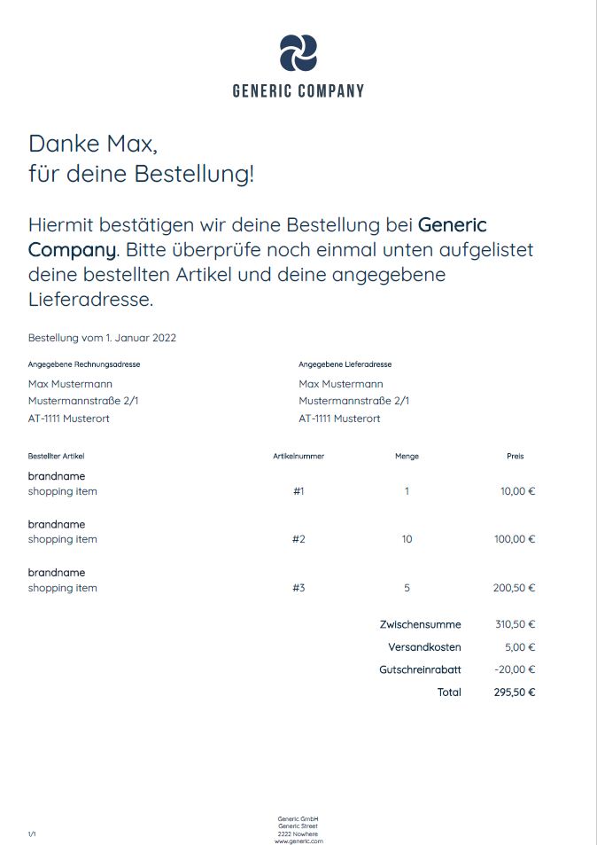

# Invoice-pdf-Generator
Generates an invoice from provided json data via post request.
## Testing


`npm run test` will send sample request data located at [`./test/request.json`](./test/request.json) by using curl:
```sh
curl -X POST -H 'Content-Type: application/json' -d @./test/request.json http://localhost:3002 --output ./test/result/result.pdf
```
